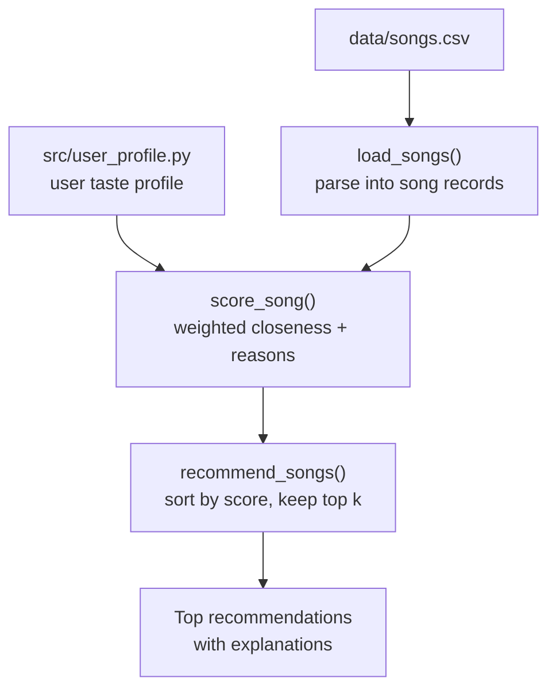

# 🎵 Music Recommender Simulation

> A **content-based** music recommender that scores every song against a user's taste profile, ranks the best matches, and explains **why** each one was chosen.


---

## 📑 Table of Contents

- [Overview](#overview)
- [Features](#features)
- [How the System Works](#how-the-system-works)
  - [Song Features](#song-features)
  - [User Profile](#user-profile)
  - [Algorithm Recipe](#algorithm-recipe)
- [System Flow](#system-flow)
- [Project Structure](#project-structure)
- [Getting Started](#getting-started)
- [Running Tests](#running-tests)
- [Sample Output](#sample-output)
- [Experiments](#experiments)
- [Limitations and Risks](#limitations-and-risks)
- [Model Card](#model-card)
- [Future Improvements](#future-improvements)
- [Tech Stack](#tech-stack)

---

## Overview

This project is a small **content-based** music recommendation system built with Python.

The system compares songs from a CSV dataset against a predefined **user taste profile**. Each song receives a similarity score based on features such as genre, mood, energy, tempo, valence, danceability, and acousticness. The highest-scoring songs are returned as recommendations, and the program **explains why** each song was selected — making the process easy to understand.

In short, it demonstrates how a recommender transforms user preferences and item features into ranked predictions.

---

## Features

- 🎯 **Content-based scoring** — compares each song directly with the user's preferred characteristics (no other listeners required).
- 📏 **Closeness, not "more is better"** — numeric features reward songs *near* the user's target, so a chill listener isn't handed the most intense track.
- 🧬 **Genre-family matching** — `indie pop` and `dance-pop` earn partial credit for a `pop` fan.
- ⚖️ **Weighted features** — genre and energy count more than danceability or acousticness.
- 💬 **Human-readable explanations** — every recommendation lists the reasons behind it.
- ✅ **Tested** — core behavior is covered by `pytest`.

---

## How the System Works

The system uses a **content-based recommendation approach**. Instead of comparing the user with other listeners, it compares each song directly with the user's preferred musical characteristics.

The logic is split into two clear steps:

1. **Scoring rule** (`score_song`) — judges *one* song against the profile and returns a score plus reasons.
2. **Ranking rule** (`recommend_songs`) — scores *every* song, sorts them, and keeps the top `k`.

### Song Features

Each song in `data/songs.csv` contains the following information:

| Feature | Description |
|---|---|
| `id` | Unique identifier for the song |
| `title` | Name of the song |
| `artist` | Name of the artist |
| `genre` | Musical category, such as pop or reggaeton |
| `mood` | General feeling of the song, such as happy or relaxed |
| `energy` | How intense the song sounds, from `0.0` to `1.0` |
| `tempo_bpm` | Speed of the song in beats per minute |
| `valence` | How positive or cheerful the song sounds (`0.0`–`1.0`) |
| `danceability` | How suitable the song is for dancing (`0.0`–`1.0`) |
| `acousticness` | How acoustic the song sounds (`0.0`–`1.0`) |

The catalog contains **30 songs** spanning **18 genres** (pop, reggaeton, salsa, lofi, jazz, funk, afrobeats, synthwave, and more) and **17 moods** (happy, sad, relaxed, energetic, intense, chill, and others).

### User Profile

The user profile stores the listener's preferred genres and moods, along with target values for the numerical features. It lives in `src/user_profile.py`:

```python
user_profile = {
    "favorite_genres": ["pop", "latin-pop", "reggaeton"],
    "favorite_moods": ["happy", "energetic"],
    "target_energy": 0.75,
    "target_tempo_bpm": 115,
    "target_valence": 0.80,
    "target_danceability": 0.85,
    "target_acousticness": 0.20,
}
```

This profile represents a listener who prefers happy, energetic, danceable music with low acousticness.

### Algorithm Recipe

Every song is scored against the profile. Categorical features score by **match**; numerical features score by **closeness** to the target. Each feature contributes its weight × its match value:

| Feature | Type | Weight | How it is matched |
|---|---|:--:|---|
| **Genre** | categorical | **2.0** | `1.0` exact · `0.5` same family · `0` otherwise |
| **Energy** | numeric | **1.5** | closeness to target |
| **Mood** | categorical | **1.0** | `1.0` exact · `0` otherwise |
| **Valence** | numeric | **1.0** | closeness to target |
| **Tempo** | numeric | **0.5** | closeness to target |
| **Danceability** | numeric | **0.5** | closeness to target |
| **Acousticness** | numeric | **0.5** | closeness to target |

> **Why genre outweighs mood:** genre is an independent signal, while mood largely mirrors the numeric valence/energy already being scored — so mood is deliberately weighted lower to avoid double-counting.

**Genre partial credit.** When a song's genre shares a word with a favorite (e.g. `indie pop` ↔ `pop`), it earns half credit for belonging to a related family.

**Closeness for numeric features.** Similarity is based on how far the song's value is from the target, normalized by that feature's range across the catalog:

```text
closeness = 1 − ( | song_value − target | ÷ feature_range )
```

Normalizing by the feature range keeps **every** numeric feature comparable on a `0.0`–`1.0` scale — this matters most for `tempo_bpm`, which is measured in beats per minute instead of `0.0`–`1.0`.

```text
Example — energy (catalog range ≈ 0.65)

target energy = 0.75
song energy   = 0.70
closeness     = 1 − ( |0.75 − 0.70| ÷ 0.65 ) = 1 − 0.08 = 0.92
```

A smaller difference produces a higher closeness score.

**Final score.** The weighted contributions are combined into a single `0.0`–`1.0` score (a weighted average over the features the profile actually specifies):

```text
score = Σ ( weight × match_value )  ÷  Σ ( active weights )
```

### Final Ranking

After scoring, the system:

1. Calculates a score for each song.
2. Stores the reasons that contributed to the score.
3. Sorts the songs from highest score to lowest.
4. Selects the top `k` songs.
5. Displays the title, score, and explanation.

---

## System Flow



---

## Project Structure

```text
AI_ENGINEER PROJECT #3/
├── data/
│   └── songs.csv            # song catalog (30 tracks)
├── src/
│   ├── __init__.py
│   ├── main.py              # command-line runner
│   ├── recommender.py       # scoring + ranking logic
│   └── user_profile.py      # the user taste profile
├── tests/
│   └── test_recommender.py  # pytest suite
├── .gitignore
├── ai_interactions.md
├── model_card.md
├── README.md
└── requirements.txt
```

---

## Getting Started

### 1. Clone the repository

```bash
git clone YOUR_REPOSITORY_URL
cd YOUR_PROJECT_FOLDER
```

### 2. Create a virtual environment

```bash
python -m venv .venv
```

Activate it on **macOS / Linux**:

```bash
source .venv/bin/activate
```

Activate it on **Windows**:

```bash
.venv\Scripts\activate
```

### 3. Install dependencies

```bash
pip install -r requirements.txt
```

### 4. Run the application

```bash
python -m src.main
```

> Run this from the **project root** so the `data/songs.csv` path resolves correctly.

---

## Running Tests

Run the test suite with:

```bash
pytest
```

The tests live in `tests/test_recommender.py` and check that recommendations are sorted by score and that each one comes with a non-empty explanation.

---

## Sample Output

Running `python -m src.main` with the profile above produces:

```text
Top recommendations:

Sunrise City — Score: 0.96
Because: Recommended because 'pop' is a favorite genre; mood 'happy'
matches your taste; energy level is close to your target; positivity is
close to your target; tempo is close to your target; danceability is
close to your target; acousticness is close to your target.

Shape of You — Score: 0.91
Because: Recommended because 'pop' is a favorite genre; mood 'happy'
matches your taste; positivity is close to your target; danceability is
close to your target.

Happy — Score: 0.89
Because: Recommended because 'pop' is a favorite genre; mood 'happy'
matches your taste; energy level is close to your target; acousticness
is close to your target.
```

> 💡 Notice that `Despacito` (reggaeton) and `Rooftop Lights` (indie pop) also surface — proof that multi-genre favorites and genre-family matching are working.

### Demo

_Add a screenshot or short screen recording of the running project here._

---

## Experiments

### Experiment 1 — Increasing the genre weight

I increased the genre weight to make exact genre matches more important. This caused the system to recommend more songs from the user's favorite genres — but it also reduced variety, because songs from other genres received lower scores even when their mood and numerical features were similar.

### Experiment 2 — Adding mood

Adding mood improved the recommendations because songs could match the emotional experience the user wanted. For example, a happy song from a related genre could rank higher than an exact genre match with a very different mood.

### Experiment 3 — Adding numerical features

Energy, tempo, valence, danceability, and acousticness helped the system distinguish between songs within the same genre. For example, it could separate energetic pop songs from calm or acoustic pop songs.

---

## Limitations and Risks

- The dataset contains a small number of songs.
- Song features were manually labeled and may be subjective.
- Mood and genre do not always have one correct label.
- The system may over-prioritize genre and ignore songs from unfamiliar genres.
- A single user profile cannot represent every listening situation (studying, exercising, relaxing, or partying).
- The system does not analyze song lyrics or language.
- It does not learn from skips, likes, repeated plays, or listening history.
- Songs with missing or inaccurate feature values may receive unfair scores.
- The recommender may repeatedly suggest similar songs and reduce musical variety.

Because this is a content-based system, the quality of the recommendations depends heavily on the quality of the dataset and the chosen feature weights.

---

## Model Card

A detailed model card — covering intended use, data, strengths, bias, and evaluation — is available here:

📄 [**Model Card**](model_card.md)

**In brief:** this project helped me understand how a recommender converts information into a prediction. Each song is represented by features, the user by a taste profile; the system compares the two, scores, and ranks. I learned that changing a single feature weight can significantly change the recommendations, and that bias can appear through manually selected labels and scoring rules — for instance, over-weighting genre can stop a user from discovering songs from other genres that still match their mood and energy.

---

## Future Improvements

- Allow the user to enter preferences through an interface.
- Learn from likes and dislikes.
- Create separate profiles for studying, exercising, and relaxing.
- Recommend more songs from related genres.
- Add diversity rules to prevent repeated recommendations.
- Use a larger and more diverse song dataset.
- Add a web interface using Flask or Streamlit.
- Connect to a music API for real song information.

---

## Tech Stack

- **Python 3.13**
- **CSV** for the song catalog
- **pytest** for testing
- **Git & GitHub** for version control
- Built with **Visual Studio Code**
