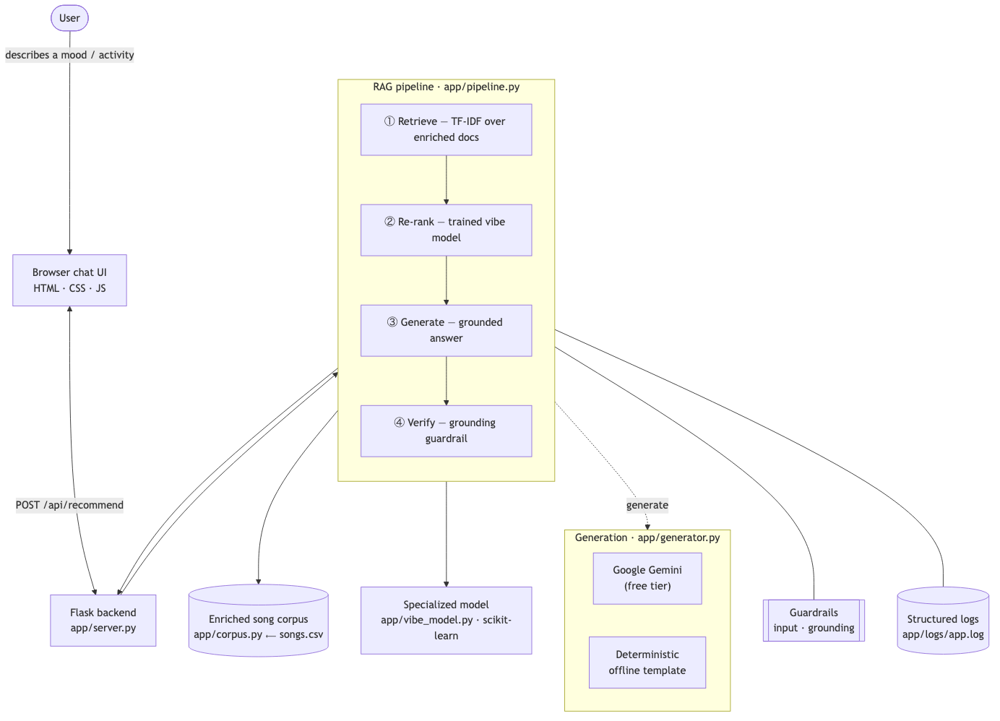

# AI Playlist Generator

**Create the perfect playlist in seconds.** Describe a mood, activity, or genre in plain language
and this app builds a ranked playlist and explains every pick. It **retrieves** matching songs from
a local catalog (**RAG**), **re-ranks** them with a **trained scikit-learn "vibe" model**, and
**generates** a grounded explanation — using **Google Gemini** (free tier) when a key is set, or a
fully local **offline** mode otherwise. Create a free account to **save** playlists and revisit them
anytime.

## Architecture overview



A **Flask** app serves a modern web UI (landing page, account pages, and a saved-playlist library)
and runs a four-stage **RAG pipeline**: **retrieve** relevant songs (semantic Gemini embeddings, or
local TF-IDF), **re-rank** them with the trained vibe classifier, **generate** a grounded answer
(Gemini or an offline template), and **verify** it. User accounts (email + password via Flask-Login)
and saved playlists persist in a local **SQLite** database. A component + testing view is in
[`diagrams/system-overview.mmd`](diagrams/system-overview.mmd).

## Setup

```bash
python3 -m venv .venv
source .venv/bin/activate            # Windows: .venv\Scripts\activate
pip install -r requirements.txt
cp .env.example .env                 # optional: add a free GEMINI_API_KEY and a SECRET_KEY; skip to run offline
python run.py                        # → http://127.0.0.1:5000
```

Open the site, create an account, and start saving playlists — the first run creates a local
`app/app.sqlite` database automatically (it's gitignored).

## Web app & accounts

Pages: `/` (generate playlists), `/signup` and `/login` (email + password), and `/library` (your
saved playlists).

| Method & path | Purpose |
| --- | --- |
| `POST /api/recommend` | Run the RAG pipeline for a prompt |
| `POST /api/auth/signup` · `login` · `logout`, `GET /api/auth/me` | Manage the account session |
| `GET` / `POST /api/playlists`, `DELETE /api/playlists/<id>` | List, save, and delete your playlists |

Passwords are stored only as salted Werkzeug hashes, and login sessions are signed with `SECRET_KEY`.

## Sample interaction

> **You:** sad songs for a rainy day
>
> **Recommender:**
> - "Someone Like You" by Adele — sad pop, melancholy vibe (match 0.97)
> - "Lovely" by Billie Eilish and Khalid — sad alternative-pop, melancholy vibe (match 0.89)
> - "Shallow" by Lady Gaga and Bradley Cooper — emotional pop, melancholy vibe (match 0.70)
>
> *RAG steps: retrieve → re-rank (desired vibe: melancholy) → grounding passed*

## Design decisions

- **RAG over an enriched catalog** — structured songs become descriptive text so retrieval matches
  by meaning, and the model answers **only** from retrieved songs.
- **Trained vibe model for re-ranking** — a lightweight scikit-learn classifier (not a heavy
  fine-tune) is fast, free, and genuinely shapes which songs surface.
- **Gemini free tier + offline fallback** — real embeddings and generation with a key, but the app
  always runs and stays testable without one.
- **Grounding guardrail** — invented song titles are detected and replaced, keeping answers
  faithful to the data.

## Testing

`pytest` runs deterministically offline and covers retrieval relevance, the vibe model (training,
prediction, cross-validation ≈ 0.70), the embedding retriever, re-rank integration, output
grounding, the HTTP API, and the account + saved-playlist flows (signup/login, password hashing,
and per-user playlist isolation). At runtime, the grounding guardrail additionally checks every
generated answer for hallucinated songs before it reaches the user.

## Reflection

This project taught me a lot about **applied AI and problem-solving** — how to combine retrieval, a
trained model, and generation into one reliable pipeline, and how to keep AI outputs grounded and
testable instead of trusting them blindly. It also taught me how to **collaborate with AI**:
breaking an open-ended goal into clear decisions, iterating through pivots, and verifying results
at each step.
