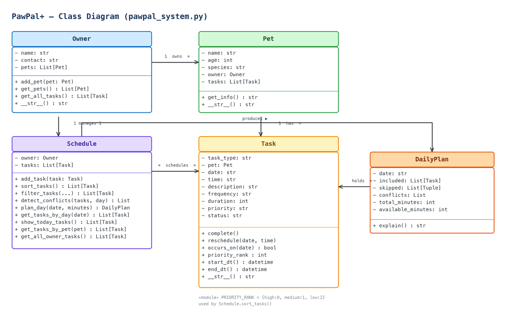

<div align="center">

# 🐾 PawPal+

**A smart pet‑care scheduler that builds — and explains — your pet's daily plan.**


</div>

---

## Overview

PawPal+ helps a busy pet owner stay consistent with pet care. Add your pets and their
care tasks (walks, feeding, medicine, grooming…), tell it how many minutes you have
today, and PawPal+ produces a **prioritized daily plan** — fitting in what it can,
**skipping what won't fit** (and saying why), **flagging scheduling conflicts**, and
**explaining every decision**.

> Module 2 project: design the system (UML) → implement the logic in Python → connect it to a Streamlit UI.

## ✨ Features

- 🗂️ **Owner / pet / task management** — model an owner, their pets, and each pet's care tasks
- 🔼 **Priority‑aware sorting** — high → medium → low, ties broken by earliest start time
- ⏱️ **Time‑budget planning** — fits tasks into the minutes you have and skips the rest *with a reason*
- 🔁 **Recurring tasks** — `once` / `daily` / `weekly` / `monthly`, surfaced on the right days
- ⚠️ **Conflict detection** — flags overlapping time windows for the same pet
- 💬 **Explainable plans** — the app tells you *why* it chose that order
- ✅ **Unit‑tested core logic** — the scheduling rules are covered by tests

## 🏗️ Architecture

The domain logic lives in **`pawpal_system.py`** and is completely independent of the UI,
so it can be tested on its own. **`app.py`** (Streamlit) and **`main.py`** (CLI) are just
two thin front‑ends that render what the logic produces.

<div align="center">



<sub>Editable source: <a href="diagrams/pawpal_classes.excalidraw"><code>diagrams/pawpal_classes.excalidraw</code></a></sub>

</div>

| Class | Responsibility |
|-------|----------------|
| `Owner` | Stores owner info and manages a list of pets. |
| `Pet` | A pet (name, age, species) that belongs to an owner and holds its tasks. |
| `Task` | A single care task with type, date/time, duration, frequency, **priority**, and status. |
| `Schedule` | Sorts, filters, detects conflicts, and builds the daily plan. |
| `DailyPlan` | The computed plan: included tasks, skipped tasks (with reasons), conflicts, and an `explain()` summary. |

## 🧠 How the scheduler works

PawPal+ turns a raw task list into an ordered daily plan using a few simple algorithms:

| Feature | Method(s) | Notes |
|---------|-----------|-------|
| Task sorting | `Schedule.sort_tasks` | Sorts by priority (high → low), then earliest start time. |
| Filtering | `Schedule.filter_tasks`, `Schedule.plan_day` | `filter_tasks` narrows by status/type/pet; `plan_day` greedily fits tasks into an available‑minutes budget and skips the rest. |
| Conflict handling | `Schedule.detect_conflicts` | Flags overlapping time windows for the same pet (start/duration overlap). |
| Recurring tasks | `Task.occurs_on`, `Schedule.get_tasks_by_day` | `once` / `daily` / `weekly` (every 7 days) / `monthly` (same day‑of‑month), measured from the task's start date. |
| Plan reasoning | `Schedule.plan_day` → `DailyPlan.explain` | Returns the chosen order, skipped tasks (with reasons), conflicts, and total scheduled minutes. |

## 🚀 Quickstart

```bash
# 1. Set up a virtual environment
python -m venv .venv
source .venv/bin/activate        # Windows: .venv\Scripts\activate

# 2. Install dependencies
pip install -r requirements.txt

# 3a. Launch the Streamlit app (opens at http://localhost:8501)
streamlit run app.py

# 3b. …or run the command-line demo
python main.py
```

## 📖 Usage

Reproduce a full plan in the Streamlit UI:

1. **Save the owner** — enter a name and contact, then click **Save owner**. This creates the `Owner` and an empty `Schedule` for the session.
2. **Add a pet** — enter a name, age, and species and click **Add pet**. Repeat to add more pets (e.g., Max the dog and Luna the cat).
3. **Add care tasks** — pick the pet, type (walk / feeding / medicine / grooming), date, time, description, **frequency**, **duration**, and **priority**, then click **Add task**.
4. **Set your time budget** — under *Smart Daily Plan*, enter how many minutes you have today (`0` = no limit).
5. **Read the plan** — PawPal+ lists today's tasks **highest priority first, then earliest time**, marks any that **don't fit the time budget** as skipped (with the reason), flags **time conflicts** for the same pet, and offers a **"Why this plan?"** explanation. Click **Done** to complete a task and watch the plan update.

## 🖥️ Sample output

Running `python main.py`:

```text
====================================================
  PawPal+ — Today's Schedule (2026-07-03)
  Owner : Alice  |  alice@example.com
  Pets  : Max (dog, age 4), Luna (cat, age 2)
====================================================
  [PENDING] (high priority) medicine — Flea treatment drops for Luna on 2026-07-03 at 9:30 AM (monthly)
  [PENDING] (high priority) grooming — Quick brush-down for Max on 2026-07-03 at 12:05 PM (weekly)
  [PENDING] (medium priority) feeding — Dry kibble — one cup for Max on 2026-07-03 at 12:00 PM (daily)
  [PENDING] (low priority) walk — Morning walk around the park for Max on 2026-07-03 at 8:00 AM (daily)

----------------------------------------------------
  Smart plan for a 40-minute window
----------------------------------------------------
Plan for 2026-07-03:
  Time budget: 40 min | Scheduled: 35 min
  Order (highest priority first, then earliest time):
    1. 09:30 — medicine for Luna (high priority, 5 min)
    2. 12:05 — grooming for Max (high priority, 20 min)
    3. 12:00 — feeding for Max (medium priority, 10 min)
  Skipped walk for Max: needs 30 min but only 5 min left
  ⚠ Conflict: grooming (12:05) overlaps feeding (12:00) for Max
====================================================
```

## 🧪 Testing

```bash
pytest              # run the full suite
pytest --cov        # run with coverage
```

```text
======================= test session starts =======================
collected 10 items

tests/test_pawpal.py ..........                             [100%]

======================== 10 passed in 0.01s =======================
```

The tests cover the behaviors that make the scheduler "smart": priority sorting,
time‑budget filtering, recurrence (`occurs_on`), and conflict detection.

## 📁 Project structure

```text
.
├── app.py                          # Streamlit UI (thin front-end)
├── main.py                         # Command-line demo
├── pawpal_system.py                # Core domain + scheduling logic
├── requirements.txt                # Dependencies
├── tests/
│   └── test_pawpal.py              # Unit tests
├── diagrams/
│   ├── pawpal_classes.excalidraw   # Editable class diagram
│   └── pawpal_classes.png          # Rendered class diagram
├── reflection.md                   # Project reflection
└── ai_interactions.md              # AI collaboration log
```

## 🛠️ Tech stack

- **Python 3.13** — core language (dataclasses, type hints, `datetime`)
- **Streamlit** — interactive web UI
- **pytest** — unit testing

## 📝 Reflection

Design decisions, scheduling trade‑offs, and lessons learned are written up in
[`reflection.md`](reflection.md).
