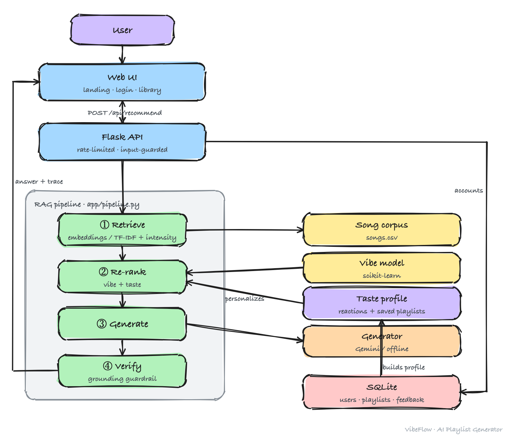

# AI Playlist Generator

**Create the perfect playlist in seconds.** Describe a mood, activity, or genre in plain language
and this app builds a ranked playlist and explains every pick. It **retrieves** matching songs from
a local catalog (**RAG**), **re-ranks** them with a **trained scikit-learn "vibe" model**, and
**generates** a grounded explanation — using **Google Gemini** (free tier) when a key is set, or a
fully local **offline** mode otherwise. Create a free account to **save** playlists, react with
👍 / 👎 to teach it your taste, and dial in nuance like **intensity** — it learns from your feedback
to personalize future rankings.

## Architecture overview



A **Flask** app serves a modern web UI (landing page, account pages, and a saved-playlist library)
and runs a four-stage **RAG pipeline**: **retrieve** relevant songs (semantic Gemini embeddings, or
local TF-IDF), **re-rank** them with the trained vibe classifier, **generate** a grounded answer
(Gemini or an offline template), and **verify** it. User accounts (email + password via Flask-Login)
and saved playlists persist in a local **SQLite** database. Reactions are stored as feedback and
aggregated into a per-user **taste profile** that nudges ranking, and an **intensity** signal
(parsed from the query or set explicitly) biases retrieval and re-ranks candidates by each song's
energy — so it changes which songs surface. A component + testing view is in
[`diagrams/system-overview.mmd`](diagrams/system-overview.mmd).

## Setup

```bash
python3 -m venv .venv
source .venv/bin/activate            # Windows: .venv\Scripts\activate
pip install -r requirements.txt
cp .env.example .env                 # optional: add a free GEMINI_API_KEY and a SECRET_KEY; skip to run offline
python run.py                        # → http://127.0.0.1:5050
```

Open the site, create an account, and start saving playlists — the first run creates a local
`app/app.sqlite` database automatically (it's gitignored).

## Web app & accounts

Pages: `/` (generate playlists), `/signup` and `/login` (email + password), and `/library` (your
saved playlists).

| Method & path | Purpose |
| --- | --- |
| `POST /api/recommend` | Run the RAG pipeline for a prompt (optional `intensity`: `low`/`medium`/`high` or `0`–`1`) |
| `POST /api/auth/signup` · `login` · `logout`, `GET /api/auth/me` | Manage the account session |
| `GET` / `POST /api/playlists`, `DELETE /api/playlists/<id>` | List, save, and delete your playlists |
| `POST` / `GET /api/feedback` | React 👍 / 👎 to a song (a repeat click toggles it off); list reactions |
| `GET /api/profile` | Your aggregated taste profile |

Passwords are stored only as salted Werkzeug hashes, and login sessions are signed with `SECRET_KEY`.

### Personalization — learning from your history

The recommender **learns from each user's history** — both explicit reactions and the playlists
they save — and biases future rankings toward it, transparently:

- **React to results** — 👍 / 👎 on any track (a repeat click clears it, the opposite flips it).
- **Learns from history, not just clicks** — a per-user **taste profile** aggregates your reactions
  *and the songs in your saved playlists* (a weighted implicit signal) into preferred vibes, genres,
  artists, and intensity. So even without a single 👍, saving playlists personalizes your results.
- **Visible evidence** — recommendations show an `✨ Personalized from your history — N reactions and
  M saved playlists` line, each biased track shows **why** ("✨ you like Voltline", "matches your
  upbeat taste"), and `/api/recommend` returns a `personalization` summary plus a `personal_why`
  and `personal_score` per song. Your taste profile is shown on the library page.
- **Bounded nudge** — the taste score layers onto retrieval + vibe rather than replacing it, so
  results stay relevant; ranking is unchanged when there's no history.
- **Intensity nuance** — phrases like "high-energy", "mellow", or "not too intense" (plus a Low /
  Medium / High control that re-runs on demand) set a target energy that both **biases retrieval**
  and re-ranks by it, so the *set* of songs changes, not just their order.

## Experience — responsive, accessible, and resilient

- **Play anywhere** — every track, in results and your saved library, links out to search it on
  **Spotify, YouTube Music, and Apple Music** (no API keys — it opens the service's search, and the
  card layout stays offline-first).
- **Loading states** — a generation runs the full RAG pipeline, so the result card shows a shimmer
  **skeleton** while it works and the button switches to a spinner ("Creating…"); saving a playlist
  shows its own spinner. "Quick actions" shortcuts fill and generate **in place** without reloading.
- **Error handling is visible, never silent** — network/API failures raise a **toast** with the
  server's message (e.g. "Could not create a playlist"); login/sign-up errors appear inline
  (`role="alert"`); rate-limited requests return a friendly **429**. Graceful fallbacks keep the app
  running: **Gemini → offline template** on any API error or timeout, **semantic embeddings → local
  TF-IDF** without a key/network, and the library shows a clear "couldn't reach the server" state.
- **Mobile & responsive** — a fluid layout (`clamp()` typography, flexible auto-fill grids) with a
  760px breakpoint that reflows the nav, hero, and cards to a single column.
- **Accessibility** — a skip link, semantic landmarks (`header`/`nav`/`main`/`footer`), **ARIA live
  regions** that announce new results, labelled controls and dropdowns (`aria-label`,
  `aria-haspopup`, `aria-expanded`), full keyboard support (Enter to generate, Escape closes menus),
  visible `:focus-visible` outlines, and a `prefers-reduced-motion` mode that disables animations.

## Sample interaction

> **You:** sad songs for a rainy day
>
> **Result:** a ranked playlist **card** — each track shows its title, artist, genre/mood tags, a
> match score, "Play on Spotify / YouTube / Apple Music" links, and 👍 / 👎 to teach your taste:
> - "Someone Like You" — Adele · sad pop · **97% match**
> - "Lovely" — Billie Eilish & Khalid · sad alternative-pop · **89% match**
> - "Shallow" — Lady Gaga & Bradley Cooper · emotional pop · **73% match**
>
> Badges show the detected **melancholy** vibe; a Low / Medium / High **intensity** control re-runs
> it, and signed-in users get an `✨ Personalized from your history` line with a per-song reason.
> *(RAG steps: retrieve → re-rank → generate → verify.)*

## Design decisions

- **RAG over an enriched catalog** — structured songs become descriptive text so retrieval matches
  by meaning, and the model answers **only** from retrieved songs.
- **Trained vibe model for re-ranking** — a lightweight scikit-learn classifier (not a heavy
  fine-tune) is fast, free, and genuinely shapes which songs surface.
- **Gemini free tier + offline fallback** — real embeddings and generation with a key, but the app
  always runs and stays testable without one.
- **Grounding guardrail** — invented song titles are detected and replaced, keeping answers
  faithful to the data.
- **Personalization as a bounded nudge** — a user's history (👍/👎 reactions **and** saved playlists)
  and a requested intensity layer onto the retrieval + vibe score rather than replacing it, so
  results stay relevant while adapting to taste; each bias is explained per song, and default
  ranking is unchanged when there's no history or intensity.
- **Abuse & injection defense** — the pipeline endpoint and auth routes are rate-limited per client
  (Flask-Limiter), and the free-text query is sanitized (control characters stripped, whitespace
  collapsed) and screened for prompt injection; a suspected attempt skips the LLM entirely and uses
  the deterministic offline generator, with output grounding as a second layer.

## Testing

`pytest` runs deterministically offline and covers retrieval relevance, the vibe model (training,
prediction, cross-validation ≈ 0.70), the embedding retriever, re-rank integration, output
grounding, the HTTP API, the account + saved-playlist flows (signup/login, password hashing,
per-user isolation), personalization (intensity detection, taste-profile aggregation, reaction
toggles, and their ranking effects), and hardening (input sanitization, prompt-injection detection
that bypasses the LLM, and rate-limit 429s). At runtime, the grounding guardrail additionally checks
every generated answer for hallucinated songs before it reaches the user.

## Deployment

The dev server (`python run.py`) is for local use only. For production the app ships with a
**gunicorn** WSGI config and a **Docker** setup:

```bash
cp .env.example .env             # set a strong SECRET_KEY (and optional GEMINI_API_KEY)
docker compose up --build        # → http://localhost:8000
# …or without Docker:
gunicorn --config gunicorn.conf.py app.server:app
```

- `gunicorn.conf.py` preloads the app so the schema is created once (no multi-worker boot race) and
  disposes each worker's DB engine after fork; the Docker image runs as a non-root user and
  pre-trains the vibe model at build time.
- **Scaling past SQLite / a single process:** point `DATABASE_URL` at Postgres
  (`postgresql+psycopg2://…`, add `psycopg2-binary`) and `RATELIMIT_STORAGE_URI` at Redis
  (`redis://…`) so data and rate limits are shared across workers/instances — both are wired as
  commented services in `docker-compose.yml`. Tunables: `WEB_CONCURRENCY`, `RATELIMIT_RECOMMEND`,
  `RATELIMIT_AUTH`.

## Reflection

This project taught me a lot about **applied AI and problem-solving** — how to combine retrieval, a
trained model, and generation into one reliable pipeline, and how to keep AI outputs grounded and
testable instead of trusting them blindly. It also taught me how to **collaborate with AI**:
breaking an open-ended goal into clear decisions, iterating through pivots, and verifying results
at each step.
